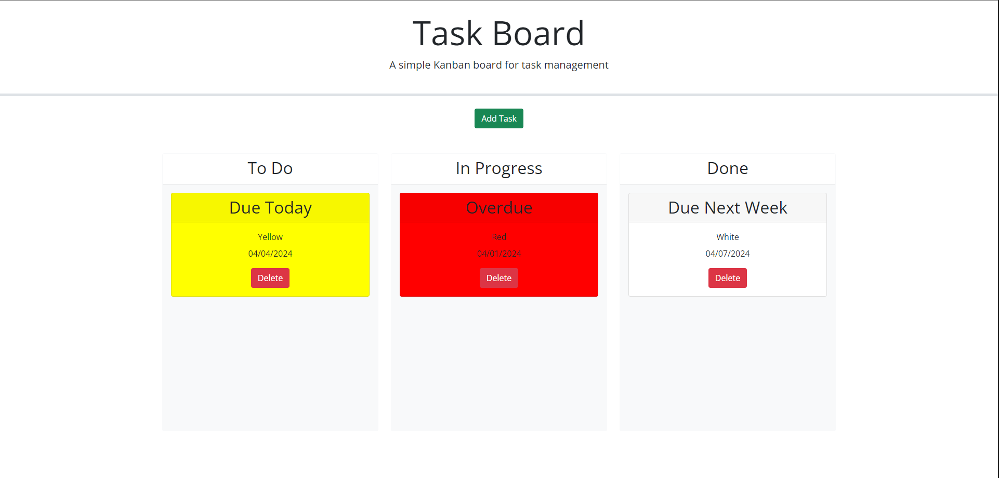

# Employee Payroll-Tracker

Week 5 Challenge - Create an employee payroll tracker using JavaScript.

## Description

The purpose of this project was to create a kanban style task board with drag and drop, deleteable, and day-based coloration functionality. I created this project to apply all of my current coding knowledge in a realistic setting, especially using javascript to store object to local storage and use them to populate dynamically created elements on my page. Through this project I have learned many different third party API syntaxes and their functionality. I have also gained considerable comfortability with passing parameters to various functions within my code.

## Table of Contents

- [Original Code](#original-code)
- [Code Source](#code-source-within-this-repo)
- [Usage](#usage)
- [Credits](#credits)
- [License](#license)

## Original Code

The original, unedited code for this project can be found [HERE](https://git.bootcampcontent.com/University-of-Richmond/UR-VIRT-FSF-PT-02-2024-U-LOLC/-/tree/main/05-Third-Party-APIs/02-Challenge?ref_type=heads)

## Code Source Within This Repo

The HTML code within this repo can be found at [./index.html](index.html)

The JavaScript can be found at [./assets/js/script.js](./assets/js/script.js)

## Usage

The live deployment of this project can be found at [https://h-lane.github.io/task-board/](https://h-lane.github.io/task-board/)

## Credits

- University of Richmond Coding Bootcamp
- README Template provided by [The Coding Bootcamp Github](https://coding-boot-camp.github.io/full-stack/github/professional-readme-guide)
- Bootstrap Elements used with premission from [getbootstrap.com](https://getbootstrap.com/docs/5.3/getting-started/introduction/)
- JQuery shorthand syntax used with permission from [jquery.com](https://releases.jquery.com/)
- JQuery UI elements used with permission from [jqueryui.com](https://jqueryui.com/)
- dayjs elements provided by [day.js.org](https://day.js.org/)

## License

This project has no license and is openly available.
